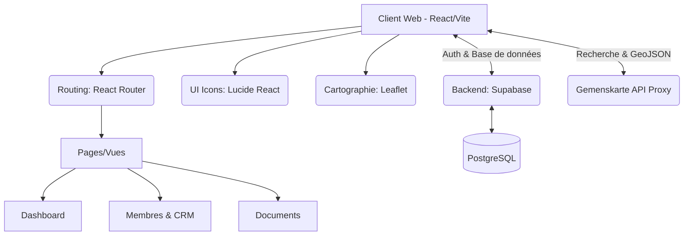

# CRM FCF (France & Régions)

Bienvenue dans le dépôt du CRM de la Fédération Culturelle de France. Ce projet est un outil de gestion moderne, conçu pour gérer l'administration, les adhérents, la recherche de prospects et le partage de documents à travers toutes les régions françaises.

## 🌟 Fonctionnalités Principales

*   **Gestion Multi-Rôles :** Une hiérarchie claire avec un accès Administrateur National (qui voit tout) et des accès Délégués Régionaux (qui ne gèrent que leur région).
*   **Tableau de Bord :** Des métriques en temps réel sur l'état des cotisations, les adhésions et l'évolution globale.
*   **Gestion des Adhérents :** Liste complète, historique des actions (timeline), statuts (À jour, À relancer, Non payé), et création de nouveaux membres.
*   **Recherche et Cartographie de Prospects :** Intégration d'une carte interactive extrêmement fluide (Leaflet) permettant de visualiser et filtrer instantanément des milliers d'associations en France par catégorie (Sport, Culture, Écologie, etc.).
*   **Suivi Commercial :** Transfert fluide d'un prospect vers un statut de suivi (À contacter, Négociation, Gagné, etc.).
*   **Centre de Documents :** Espace de partage de fichiers (PDF, documents Word, etc.) pour mettre à disposition des chartes, formulaires et comptes-rendus.

## 🏗️ Architecture Technique

Ce projet est une **Single Page Application (SPA)** construite avec l'écosystème React et propulsée par Vite pour des performances optimales.



## 🛠️ Stack Technique

*   **Frontend :** React 18, TypeScript, Vite
*   **Styling :** CSS pur (Vanilla CSS) organisé par un Design System centralisé dans `index.css`.
*   **Backend & Authentification :** Supabase (PostgreSQL, Auth, RLS)
*   **Cartographie :** Leaflet (via `leaflet` et `leaflet.markercluster` pour les performances).

## 🚀 Guide de Démarrage (Pour les Développeurs Juniors)

Ce guide est fait pour t'aider à lancer le projet sur ta machine en quelques minutes.

### 1. Prérequis
Assure-toi d'avoir installé **Node.js** (version 18 ou supérieure) sur ton ordinateur.

### 2. Installation
Clone ce dépôt sur ta machine, puis installe les dépendances avec `npm` :
```bash
git clone https://github.com/King4Kats/CRM-FCF.git
cd CRM-FCF
npm install
```

### 3. Variables d'environnement
À la racine du projet, crée un fichier nommé `.env` pour y placer les identifiants de ta base de données Supabase.
*(Note : Si tu lances le projet sans `.env`, l'application démarrera dans un mode "Démo" ou Mock, ce qui est parfait pour tester le design sans casser la base de données !)*

```env
VITE_SUPABASE_URL=https://ton-url-supabase.supabase.co
VITE_SUPABASE_ANON_KEY=ta-clef-anonyme-publique
```

### 4. Lancer le serveur de développement
Une fois installé, tape cette commande pour lancer le serveur local :
```bash
npm run dev
```
Ouvre ensuite ton navigateur à l'adresse indiquée (généralement `http://localhost:5173`).

---
*Ce code est commenté de manière didactique pour vous accompagner dans votre compréhension des composants React. Bonne exploration !*
